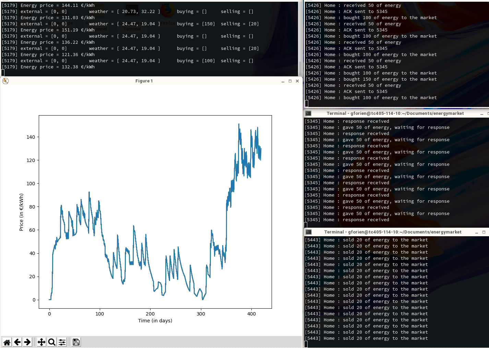

# EnergyMarket :zap::dollar::chart_with_upwards_trend:
## Simulation multi-processus avec communication inter-processus en Python

## :construction_worker_man: Lancer le projet avec Python3
On lance Market dans le terminal principal:

    $ git clone https://github.com/gforien/energymarket
    $ cd energymarket
    $ mkdir launch_dir
    $ virtualenv launch_dir
    $ source launch_dir/bin/activate
    (launch_dir) $ pip install matplotlib sysv_ipc
    (launch_dir) $ python3 Market.py

Ensuite, on lance un terminal pour chaque Home.
Les paramètres CR (*Consumption Rate*), PR (*Production Rate*), et ETP (*Energy Trade Policy*) sont tous optionnels mais doivent être spécifiés dans cet ordre. Dans chaque terminal, on exécutera par exemple:

    $ cd energymarket
    $ CR=160; PR=80; ETP=0                      # par exe   mple
    $ python3 Home.py                           # Home complètement aléatoire
    $ python3 Home.py $CR                       # ou Home avec 1 paramètre déterminé
    $ python3 Home.py $CR $PR                   # ou Home avec 2 paramètres déterminés
    $ python3 Home.py $CR $PR $ETP              # ou Home avec 3 paramètres déterminés

## :mailbox_with_mail: Protocole de communication interprocessus
On envoie dans des messageQueue des messages au format "PID:quantitéDEnergie" avec un type pour spécifier l'action attendue.
- `type=1` -> **BUY** au marché, donc seul le marché fait des `receive(type=1)`
- `type=2` -> **SELL** au marche, donc seul le marché fait des `receive(type=2)`
- `type=3` -> **GIVE** aux autres Homes, seules les Homes en besoin d'énergie font des `receive(type=3)`
- `type=PID` -> **RECEIVED** à la Home concernée, donc seule une Home qui vient de donner de l'énergie fait un `receive(type=getpid())`

La bonne communication est assurée par un délai d'attente dt = 0.2s par exemple :
- à **t = 0**, les homes ayant trop d'énergie la donnent (**GIVE**)
- à **t = dt**, les Homes ayant besoin d'énergie écoutent sur la messageQueue. S'il n'y a pas de message, elles ne bloquent pas.
    S'il y a un message, elle prennent l'énergie et notifient la Home émettrice (**RECEIVED**)
- à **t = 2\*dt**, les Homes qui ont donné de l'énergie écoutent sur la messageQueue. S'il n'y a pas de message, elles ne bloquent pas et vendent au marché (**SELL**)

##
###### Elisa BOUVET, Gabriel FORIEN 3TC INSA Lyon

